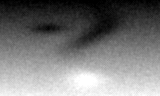
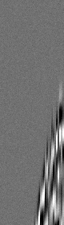

# rtm3d-cli synthetic realistic benchmark

C++20 CLI baseline for 3D acoustic RTM with a reproducible synthetic benchmark pipeline.

## Reproduce end-to-end (4 commands)
```bash
cmake -S . -B build -DCMAKE_BUILD_TYPE=Release -DRTM3D_BUILD_TESTS=ON && cmake --build build -j
python3 scripts/generate_synthetic_model.py --out-dir data/synthetic
./build/rtm3d_cli --config configs/synthetic_benchmark.json
python3 scripts/float32_to_png.py --input artifacts/synthetic_migrated_inline.bin --meta artifacts/synthetic_migrated_inline.bin.json --output artifacts/synthetic_migrated_inline.png
python3 scripts/visualize_synthetic.py --data-dir data/synthetic --out-dir artifacts/synthetic_preview --shot-index 1
```

Generated artifacts:
- `data/synthetic/velocity_model.bin` + `.json`
- `data/synthetic/shot_0001_gather.bin` + `.json`
- `data/synthetic/shot_0001.segy_like`
- `artifacts/synthetic_migrated_inline.bin` + `.json`
- `artifacts/synthetic_migrated_inline.png`

## Synthetic data previews

Velocity model (synthetic):



Shot gather (synthetic):



## Synthetic model generator
`scripts/generate_synthetic_model.py` creates a geology-inspired velocity model with:
- depth velocity gradient
- meandering channel low-velocity body
- multiple lenses (positive/negative anomalies)
- fault-like displacement perturbation
- weak correlated heterogeneity

Outputs are float32 plus metadata JSON and JSON arrays (`x.json`, `z.json`, `vel.json`) for the existing loader path.

## Synthetic acquisition generator
The same script also creates one synthetic shot gather with:
- plausible surface geometry (central shot, regular receiver spread)
- Ricker wavelet source
- moveout-like reflectivity response + light noise

Deliverables:
- `shot_0001_gather.bin` (float32 raw, row-major `[n_receivers][nt]`)
- `shot_0001_gather.bin.json` (shape/sampling/geometry)
- `shot_0001.segy_like` (strict binary+header structure)

### SEG-Y-like note
`shot_0001.segy_like` is intentionally **SEG-Y-like**, not full standards-compliant SEG-Y:
- 3200-byte textual header (ASCII padded)
- 400-byte binary header (sample interval, samples/trace, format code)
- per trace: 240-byte trace header + IEEE float32 big-endian samples

This avoids adding new dependencies while keeping exchange-friendly structure documented and deterministic.

## Config-driven dataset path
`rtm3d_cli` supports config JSON with `data_dir` / `x_file` / `z_file` / `values_file` (no hardcoded runtime paths).
See `configs/synthetic_benchmark.json`.

## Benchmark recipes

Small/fast profile (local quick checks):
```bash
python3 scripts/generate_synthetic_model.py --out-dir data/synthetic --nx 128 --nz 80 --nt 220 --n-shots 2 --scenario layered_fault --seed 17
./build/rtm3d_cli --config configs/synthetic_benchmark.json
python3 scripts/visualize_synthetic.py --data-dir data/synthetic --out-dir artifacts/synthetic_preview --shot-index 1
```

Medium profile (richer structure + multi-shot):
```bash
python3 scripts/generate_synthetic_model.py --out-dir data/synthetic --nx 192 --nz 112 --nt 420 --n-shots 3 --scenario salt_dome --snr-db 24 --seed 17
./build/rtm3d_cli --config configs/synthetic_benchmark.json
python3 scripts/visualize_synthetic.py --data-dir data/synthetic --out-dir artifacts/synthetic_preview --shot-index 2
```

## Tests
Unit + e2e:
```bash
ctest --test-dir build --output-on-failure
```

E2E test (`tests/e2e_synthetic.sh`) validates generation determinism, multi-shot artifacts, migration output integrity, and quality/stability metrics.
